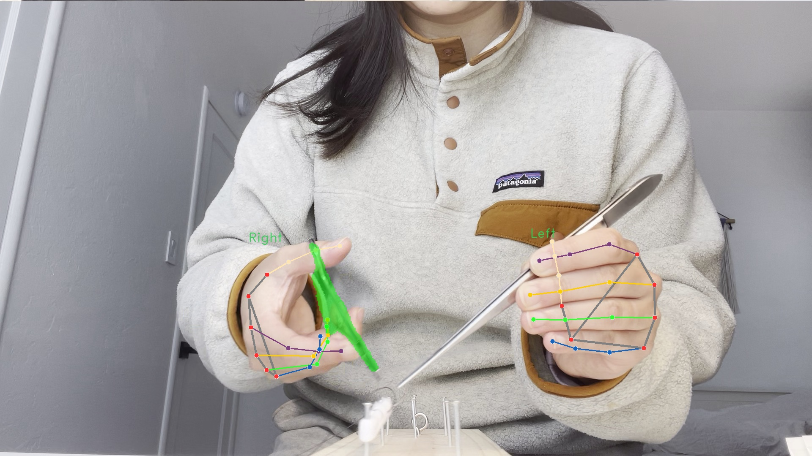
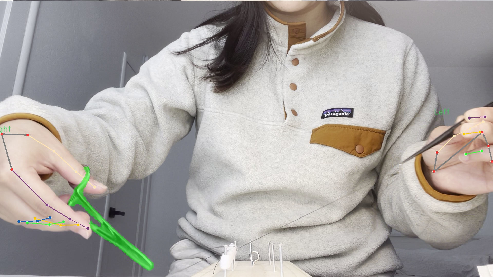

# Surgical Training Detection Project

This project uses a detector to analyze a surgical training video and draw detections on it. It can also save the detected frames to a specified directory.

## Requirements

- Python 3.x
- [Torch](<[Torch](https://pytorch.org/get-started/locally/)>) installed

## Installation

1. Clone the repository:

   ```sh
   git clone <REPOSITORY_URL>
   cd <REPOSITORY_NAME>
   ```

2. Install the required dependencies:
   ```sh
   pip install -r requirements.txt
   ```

## Usage

Run the main script `main.py` with the following arguments:

- `-v` or `--video_path`: Path to the input video file (required).
- `-i` or `--interactive`: Show the output in a window (optional).
- `-s` or `--save_path`: Path to save the output frames with detections (optional).

### Examples

1. Run detection on a video and show the output in a window:

   ```sh
   python main.py -v path/to/video.mp4 -i
   ```

2. Run detection on a video and save the detected frames to a directory:

   ```sh
   python main.py -v path/to/video.mp4 -s path/to/save/frames
   ```

   
   

## Project Structure

- `main.py`: Main script that handles user input and starts the detection.
- `detector.py`: Module that contains the `Detector` class to perform detection and draw on frames.

## Contributing

Contributions are welcome. Feel free to open issues or pull requests to improve the project.

## License

This project is licensed under the MIT License. See the `LICENSE` file for more details.
